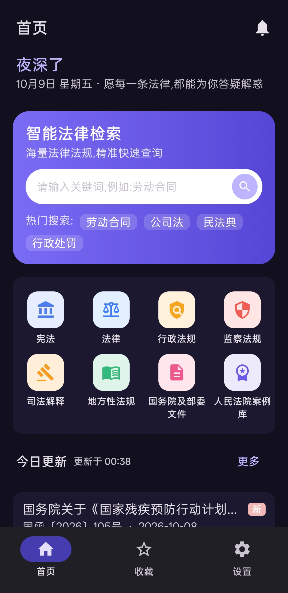
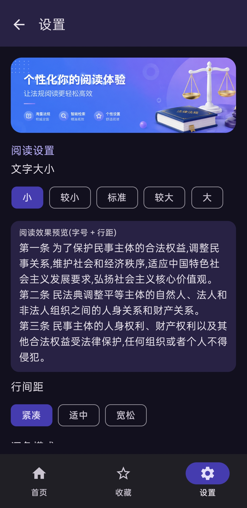
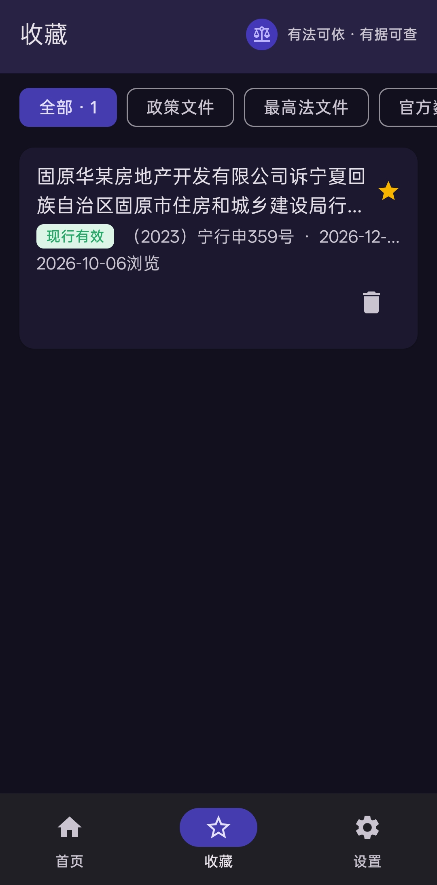

# 法条速查 LawQuery

> 官方来源 · 实时查询的法律法规检索工具（Android 原生，Kotlin + Jetpack Compose）
>
> **当前版本：`v1.0.5`**（发版时请同步更新此处与 `app/build.gradle.kts` 的 `versionName`）

<!-- 开源后替换为实际地址 -->
**仓库地址：`https://github.com/zhiluo1/LawQuery`**
**问题反馈：`https://github.com/zhiluo1/LawQuery/issues`**

   

---

## 一、项目简介

### 它是什么

「法条速查」是一个 **Android 原生**的法律法规检索 App：输入关键词或点开分类，即可检索、浏览、阅读来自**官方来源**的法规文本，并支持收藏与更新提醒。

### 解决什么问题

| 常见痛点 | 本项目的做法 |
|---|---|
| 搜到的法条不知是哪个版本、是否已修订 | 只从官方网站实时获取，每条标注来源、公布日期与时效性 |
| 网页版法规站手机阅读体验差、排版乱 | 原生解析为「章 → 节 → 条」结构，目录抽屉 + 条号直达 |
| 担心第三方站点收录不全或夹带广告 | 不自建后端、不经中间站，直接对接官方接口与官方页面 |
| 换设备后收藏丢失、无法判断是否更新 | 收藏仅存元数据（标题/来源/链接/时效指纹），打开时与官方最新元数据比对并提示「已更新」 |

### 定位

- **实时优先**：正文不做本地持久化，每次查看实时取自官方（磁盘仅保存收藏、最近浏览、搜索历史的**元数据**）。
- **官方优先**：数据来自中国政府网、国家法律法规数据库、最高人民法院、人民法院案例库、公安部规章库。
- **克制访问**：内置限流（全局并发 ≤2、同源间隔 ≥2 秒、403/429 冷却 10 分钟），不做后台轮询、不做批量爬取。

### 适用场景

- 法律工作者 / 学生 / 公务员：**随身查法条**，快速定位某一条。
- 企业合规与人事：核对劳动合同、工伤、社保等常用法规的**现行文本**。
- 普通用户：遇到纠纷时查依据、看**原文链接**去官方核对。
- 学习研究：了解 Android 原生如何合规地聚合多个公开数据源。

---

## 二、核心功能

| # | 模块 | 作用 |
|---|---|---|
| 1 | **首页** | 搜索入口、7 个法规分类入口、今日更新、最近浏览、首启免责声明 |
| 2 | **全局检索** | 跨来源关键词检索；支持「标题命中优先于正文命中」的相关度排序、搜索历史与本地联想（联想不上传） |
| 3 | **分类浏览** | 按宪法 / 法律 / 行政法规 / 监察法规 / 地方性法规 / 司法解释 / 国务院及部委文件浏览，支持时效性、年份、发文机关、地区筛选 |
| 4 | **多来源分组** | 同一分类由多个官方源供数时（如政府网 + 规章库、法规库 + 最高法），列表**按来源分组**展示，来源与条数一目了然 |
| 5 | **筛选下推** | 筛选条件尽量下推到官方接口（服务端收敛），客户端仅做兜底，避免「一筛就空」或「翻页才出结果」 |
| 6 | **详情阅读** | 元信息区 + 章/节/条懒加载；目录抽屉、条号直达、条内搜索、复制与分享、字号与行距调节、深色模式 |
| 7 | **官方阅读器** | 对提供官方阅读器的来源，在应用内直接打开官方阅读器呈现正式文本（可缩放），并保留「在系统浏览器打开」入口 |
| 8 | **收藏** | 仅保存元数据；打开收藏时与官方最新元数据比对，发现变化显示「已更新」并可一键更新指纹 |
| 9 | **今日更新** | 每次进入首页实时拉取各官方源最新发布的文件，可按分类与时效性筛选 |
| 10 | **数据源状态** | 展示各官方源的访问健康状况与最近失败原因，源暂不使用时给出明确提示 |
| 11 | **离线与降级** | 网络恢复后自动重试；单源失败只降级该源，不影响其他来源结果 |
| 12 | **隐私** | 仅申请 `INTERNET` 权限；不采集个人信息、不含账号体系、不集成第三方统计 SDK |

---

## 三、界面截图

> 截图存放于 `docs/screenshots/`，如更换界面请同步更新图片。

### 首页 · 分类入口与今日更新



首页提供 7 个法规分类入口、「今日更新」实时列表与最近浏览，顶部为全局搜索入口。

### 阅读设置 · 字号、行距与深色模式



设置页可调节正文字号与行距、切换深色模式，并以真实法规文本实时预览阅读效果。

### 收藏 · 分组与更新标记



收藏页按来源分组展示，官方元数据有变化时显示「已更新」标记，可一键校验与更新。

---

## 四、使用说明

### 运行环境要求

| 项目 | 要求 |
|---|---|
| 操作系统 | Windows / macOS / Linux（示例命令以 bash 为准） |
| JDK | **17** |
| Android SDK | Platform 36、Build-Tools 35 |
| Gradle | 使用仓库自带的 wrapper（无需另外安装） |
| Android Studio | 可选（直接 Open 打开即可） |
| 运行设备 | Android 8.0（API 26）及以上真机或模拟器 |

### 安装与启动

```bash
# 1) 克隆
git clone https://github.com/zhiluo1/LawQuery.git
cd LawQuery

# 2) 配置本机 SDK 路径（该文件不入库）
echo "sdk.dir=/path/to/your/android-sdk" > local.properties

# 3) 构建与安装
./gradlew assembleDebug          # 构建 Debug APK → app/build/outputs/apk/debug/
./gradlew installDebug           # 安装到已连接设备/模拟器

# 4) 其他常用命令
./gradlew testDebugUnitTest      # JVM 单测（解析器 / 限流 / 缓存 / 指纹）
./gradlew lint                   # 静态检查
```

> **Windows 用户注意**
> 若工程所在路径**含中文**，请把工程放到纯 ASCII 路径下再构建 —— 否则 AGP/AAPT2 可能报
> 「文件名、目录名或卷标语法不正确」。路径不含中文则无需任何处理。
> 原开发环境的一键脚本因写死本机路径，**未随本仓库分发**，请按自己的环境编写。

### 基本使用流程

1. **搜索**：首页顶部输入关键词 → 点「搜索」。结果按“标题命中优先”排序，可叠加分类、时效性、年份、发文机关等筛选。
2. **浏览**：首页点分类 → 按发布日期倒序查看，可用筛选收敛范围；滑到底自动加载下一页，到底后会明确提示。
3. **阅读**：点条目进入详情 → 展开章/节查看条文；可条号直达、条内搜索、复制或分享（均附来源与原文链接）。
4. **收藏**：详情页点星标收藏；在收藏页可分组查看、校验是否有官方更新。
5. **核对原文**：任何页面都可通过「在系统浏览器打开 / 查看原文」跳转官方页面核对。

### 克隆后需要自行配置的两处（影响实际运行）

| 位置 | 默认值 | 说明 |
|---|---|---|
| `app/src/main/java/com/lawquery/update/UpdateManager.kt` → `UpdateConfig.BASE_URL` | `https://your-update-host.example.com`（**占位**） | 应用内「检查更新」的服务地址。不配置时**只有检查更新会失败**，检索/浏览/收藏/阅读不受影响。部署方式见下节。 |
| `app/src/main/res/xml/network_security_config.xml` | 含 `192.0.2.100`（**占位**）与 `10.0.2.2` | 明文流量白名单，仅用于局域网联调更新服务。`192.0.2.100` 是 RFC 5737 文档地址，请改为你的实际 IP；`10.0.2.2` 是 Android 模拟器访问宿主机的标准地址，可保留。对外分发建议更新服务使用 HTTPS 并移除该白名单。 |

<details>
<summary>如何接入自己的更新服务（可选）</summary>

1. 准备一个静态托管地址（对象存储 / 静态网站托管均可），目录结构：

   ```
   <BASE_URL>/update.json    # 版本清单
   <BASE_URL>/app.apk        # 安装包
   ```

2. `update.json` 示例：

   ```json
   {
     "versionCode": 5,
     "versionName": "1.0.5",
     "notes": "更新说明文本",
     "apkUrl": "<BASE_URL>/app.apk",
     "sizeBytes": 23448580,
     "sha256": "<安装包 SHA256，可选但建议提供>"
   }
   ```

3. 改 `UpdateConfig.BASE_URL` 为你的地址即可（局域网联调可临时用 `http://10.0.2.2:8527`，需同步配置明文白名单）。
4. 原环境配套的发布端工具（用于一键推送更新）因含本机配置，**未包含在本仓库**；
   你也可以用任意静态托管（对象存储 / 静态网站托管）+ 手工上传 `update.json` 与 APK 完成同样的事。

</details>

### 关于人民法院案例库

- 该来源**需要使用者本人通过官方登录页登录**（App 内引导跳转官方页面，不代收账号密码）。
- 会话凭据经 **Android Keystore 加密**后仅存于本机，卸载或清除数据即失效。
- 未登录时该来源会显示「暂不可用」并给出登录入口，**其他来源不受影响**。
- 仓库中**不含**任何真实账号、Cookie 或 Token；测试用的一律为脱敏示例值。

---

## 五、技术栈与项目结构

### 主要技术

| 类别 | 选型 |
|---|---|
| 语言 | Kotlin 2.1.0（Coroutines / Flow） |
| UI | Jetpack Compose + Material 3（Compose BOM 2025.06）、Material3 WindowSizeClass 自适应 |
| 架构 | 单 Activity + Navigation Compose；MVVM（ViewModel + StateFlow）；手动 DI（`AppContainer`，不引入 Hilt） |
| 网络 | OkHttp 4.12 + Retrofit 2.11；自研 `ThrottleInterceptor`（限流/冷却）与 `BackoffRetryInterceptor`（退避重试） |
| 解析 | Jsoup 1.18（HTML）+ kotlinx.serialization 1.7.3（JSON） |
| 存储 | Room 2.6.1（收藏 / 最近浏览 / 源健康 / 搜索词，仅元数据）+ DataStore 1.1.1（设置） |
| 安全 | Android Keystore（AES/GCM）加密本地凭据 |
| 测试 | JUnit 4、Compose UI Test；官方页面快照作为离线测试样本 |
| 构建 | AGP 8.9.2、KSP、R8（release 开启混淆与资源收缩） |

### 目录结构（精简）

```
./                                  # 仓库根 = 工程根（克隆后进入即见下列内容）
├── docs/
│   ├── 法律查询APP需求文档.md      # 需求 / 合规 / 验收
│   ├── 法律查询APP项目文档.md      # 架构 / 约定 / 启动方式
│   ├── 数据源接入说明.md          # 各官方源请求方式、DOM 选择器、robots 复核记录
│   └── screenshots/              # README 截图
├── gradle/libs.versions.toml      # 依赖唯一锁定处
└── app/src/
    ├── main/java/com/lawquery/
    │   ├── MainActivity.kt        # 单 Activity 入口
    │   ├── di/AppContainer.kt     # 手动 DI 装配
    │   ├── core/
    │   │   ├── net/               # 限流 / 退避 / 健康跟踪 / 页面抓取 / UA
    │   │   ├── parse/             # 解析器与「章→节→条」结构构建
    │   │   ├── session/           # Keystore 加密的会话存储
    │   │   └── sessioncache/      # 唯一允许的缓存（内存、TTL 5 分钟）
    │   ├── data/
    │   │   ├── source/            # LawSource 接口与各官方源实现、SourceRegistry 路由与降级
    │   │   ├── repo/              # 聚合检索、详情、收藏指纹校验、历史、源状态
    │   │   └── local/             # Room 与 DataStore
    │   ├── domain/model/          # LawRef / LawDocument / LawStatus / VersionFingerprint
    │   ├── ui/                    # 首页 / 搜索 / 浏览 / 详情 / WebView / 收藏 / 设置 / 通用状态组件
    │   └── update/                # 应用内更新检查
    ├── test/                      # JVM 单测（解析、限流退避、缓存、指纹、路由）
    └── androidTest/               # Compose UI 测试
```

**分层约束**：`ui/` 不直接依赖 `core/net` 与 OkHttp；`data/source` 不依赖 `ui/`；`domain/model` 零框架依赖。

---

## 六、数据来源与访问约定

### 数据来源

| 来源 | 用途 |
|---|---|
| 国家法律法规数据库（flk.npc.gov.cn） | 六个法规分类的题录与筛选；正文在应用内官方阅读器中呈现 |
| 中国政府网（www.gov.cn） | 国务院文件与部委政策文件 |
| 最高人民法院（www.court.gov.cn） | 司法解释与司法文件（原生解析正文） |
| 公安部规章库 | 部门规章（原生解析正文） |
| 人民法院案例库 | 案例检索与阅读（**需本人登录**） |

### 访问约定

- **不做批量爬取**：仅在用户发起检索 / 浏览 / 打开详情时请求。
- **限流与冷却**：全局并发 ≤2；同一域名两次请求间隔 ≥2 秒；403/429 立即停止该源请求并冷却 10 分钟（均有单测覆盖）。
- **UA 如实标识**：请求头携带真实应用标识与版本号（`LawQuery/<version>`，取自 `BuildConfig.VERSION_NAME`），不伪装浏览器、不轮换 IP、不使用任何代理池。
- **不绕过防护**：遇到风控拦截页即按「该源暂不可用」处理并提示，不做破解、不尝试绕过。
- **不缓存正文**：条文正文零持久化；仅有一个内存态、TTL 5 分钟的会话缓存，进程结束即释放。
- **robots 与服务条款**：接入前逐源复核，记录见 `docs/数据源接入说明.md`；如某来源明确禁止程序化访问，仅保留应用内 WebView 官方页面访问。

---

## 七、致谢

### 开源项目

感谢以下优秀开源项目（版本以 `gradle/libs.versions.toml` 为准）：

- **Kotlin** 与 **Kotlinx Coroutines / Flow / Serialization** —— 语言与异步基础
- **Jetpack Compose**、**Material 3**、**Material Icons Extended**、**Navigation Compose**、**Lifecycle**、**Activity Compose** —— 声明式 UI 与导航
- **AndroidX Room** —— 本地元数据存储
- **AndroidX DataStore** —— 设置项存储
- **OkHttp**、**Retrofit** —— 网络请求
- **Jsoup** —— HTML 解析
- **JUnit**、**AndroidX Test** —— 测试
- **Android Gradle Plugin**、**KSP**、**R8** —— 构建与优化

### 数据来源

感谢各官方平台公开提供法规与案例信息（见「数据来源」一节）。本项目的全部内容均来自上述官方渠道，**不主张对法规文本享有任何权利**。

### 贡献者

- **项目作者**：`栀落` —— 需求、设计、开发与维护
- **AI 协作**：本项目在开发过程中使用 AI 助手协助代码审查、缺陷排查与文档撰写（最终实现与决策由作者负责）
- 感谢所有提交 Issue 与建议的使用者

---

## 八、免责声明（请务必阅读）

> **本项目仅供学习与技术交流使用。**

### 1. 项目性质

本项目是一个**技术学习与交流性质的开源示例**，用于展示 Android 原生应用在「多公开数据源聚合、结构化解析、合规访问限流」方面的工程实践。项目**不提供任何形式的法律服务**，不构成法律意见，也不能替代专业律师、司法机关或有权机关的正式解释与裁判。

### 2. 网页抓取与数据获取的特别声明

本项目在实现上包含**对公开网页与公开接口的访问与解析**（以下简称“网页抓取”）。就此特别声明：

1. **仅供学习与技术交流**：任何人仅可在学习、研究、技术验证的目的下使用本项目的代码与方法。
2. **遵守 robots 协议**：使用者应自行查阅并**严格遵守目标网站的 `robots.txt`**、网站声明的访问规则与爬取限制；对明确禁止程序化访问的目录或接口，不得访问。
3. **遵守服务条款与法律**：使用者应遵守目标网站的**服务条款（ToS）**、《中华人民共和国网络安全法》《数据安全法》《个人信息保护法》《著作权法》以及所在司法辖区的相关法律规定。
4. **禁止的用途**（包括但不限于）：
   - 大规模、高并发地抓取或镜像目标网站内容；
   - 绕过或规避目标网站的访问限制、验证码、风控系统、身份认证或付费墙；
   - 使用代理池、伪造 UA、伪造 Cookie 等手段伪装身份或隐藏真实来源；
   - 将抓取内容用于**商业用途**、转售、再分发或构建竞争性数据库；
   - 抓取、存储或传播涉及个人信息、国家秘密、商业秘密的内容；
   - 任何侵犯他人知识产权、隐私权或其他合法权益的行为。
5. **访问节律的内置限制不构成豁免**：项目内置的限流与冷却机制仅为工程上的克制设计，不代表目标网站允许相应频率的访问；使用者**仍须自行判断并取得必要授权**。

### 3. 由本项目代码所构成的服务同样仅供技术交流

无论以源代码、编译产物、容器镜像、服务端程序，或在其基础上进行改造、封装、二次开发后形成的**任何形态的服务**（包括但不限于 App、网站、接口服务、数据服务、Saas 服务），**均仅供学习与技术交流**，**不得用于任何经营性、营利性或面向公众的生产用途**。使用者不得将本项目或其衍生服务对外宣称具备官方背景、官方授权或与任何官方机构存在关联。

### 4. 内容准确性与时效性免责

- 项目展示的全部内容**均实时取自第三方官方渠道**，项目**不生产、不编辑、不审核**任何法规或案例内容。
- 项目**不保证**内容的**准确性、完整性、时效性、适用性**：法规可能被修订、废止或尚未生效，页面结构变化可能导致解析异常或字段缺失。
- 项目提供的时效性标签（如“现行有效”“已修订”“尚未生效”）仅依据来源页面可得信息生成，**仅供参考**；**一切以官方发布文本与有权机关的解释为准**。
- 使用者因信赖本项目展示的内容而作出的任何判断、决策或行为，其后果由使用者自行承担。

### 5. 第三方权利与知识产权

- 法规、案例及其他文本的**著作权、商标权及相关权利归原发布机关或权利人所有**。本项目不主张任何权利，仅作技术性引用与展示，并在界面中标注来源与原文链接。
- 各官方平台的名称、标识、商标均为其权利人财产；本项目的引用不构成商标使用许可或任何形式的授权。
- 如任何权利人认为本项目内容侵犯其合法权益，请通过 Issue 或邮件联系项目作者，作者将在核实后**及时移除相关内容**。

### 6. 账号、凭据与隐私

- 部分来源（如人民法院案例库）需使用者**本人**通过官方页面登录；项目**不代收、不上传、不共享**任何账号、密码、Cookie 或 Token。
- 相关凭据经系统 Keystore 加密后**仅存于使用者本人设备**；使用者应自行妥善保管设备与凭据，并对使用该账号进行的全部行为负责。
- 项目本身不采集个人信息、不设账号体系、不集成第三方统计或广告 SDK；但使用者在使用第三方官方服务时产生的数据，受该第三方隐私政策约束。

### 7. 责任限制与后果承担

在法律允许的最大范围内：

1. **风险自负**：任何人基于本项目代码进行**二次开发、修改、分发、部署、运行或用于任何用途**所产生的一切后果与法律责任，**均由使用者本人独立承担，与项目作者、贡献者无关**。
2. **作者不承担责任**：对于因使用或无法使用本项目（包括但不限于：解析错误、内容缺失或过时、访问被拒绝、账号或凭据问题、设备或数据损失、业务中断、第三方索赔、行政处罚等）造成的任何**直接、间接、偶然、特殊、惩罚性或后果性损害**，项目作者与贡献者**不承担任何责任**。
3. **无担保**：本项目按 **“现状（AS IS）”** 提供，**不附带任何明示或默示的担保**，包括但不限于对**适销性、特定用途适用性、不侵权**的担保。
4. **合规义务在使用者**：使用者**有责任**在使用前自行确认其行为在所在司法辖区合法合规，并自行取得所有必要的许可与授权。
5. **若法律规定不可排除**：若使用者所在司法辖区的法律不允许排除上述某些责任，则项目作者与贡献者的责任以法律所允许的最小范围为准。

### 8. 许可与变更

- 本项目源代码按仓库所附许可证（见 `LICENSE`，默认为 MIT）授权使用；**许可协议中另有约定的，以许可协议为准，且本免责声明中的合规要求同时适用**。
- 项目作者保留随时**修改、暂停或终止**本项目的权利，恕不另行通知；已发布版本的存档由使用者自行备份。
- 使用本项目即视为**已完整阅读、理解并同意**本免责声明的全部内容。如不同意，请立即停止使用并删除全部副本。

---

## 九、版本与更新

**当前版本：`v1.0.5`**

近期更新要点：

1. 新增最高人民法院官网数据源，「司法解释」分类收录更全
2. 多来源分类改为按来源分组展示，来源与条数一目了然
3. 修复「发文机关」筛选未真正生效、需反复下拉才看全的问题，机关候选接入官方制定机关表
4. 修复快速切换关键词或筛选时结果与条件不一致、「今日更新」加载中切换筛选不生效
5. 修复列表滑到底一直显示加载中，并在确实到底时明确提示
6. 修复部分规章展开看不到内容、翻页后日期倒跳、规章库显示不全
7. 修复收藏分组看不到已收藏内容、「已更新」标记不刷新；优化异常处理，避免后台异常导致闪退

---

## 十、许可

本项目采用 **MIT License**（详见 `LICENSE` 文件；如仓库尚未包含，请以 `栀落` 与发布年份补充）。

> 使用本项目，即表示你已阅读并同意上述**免责声明**的全部内容。
